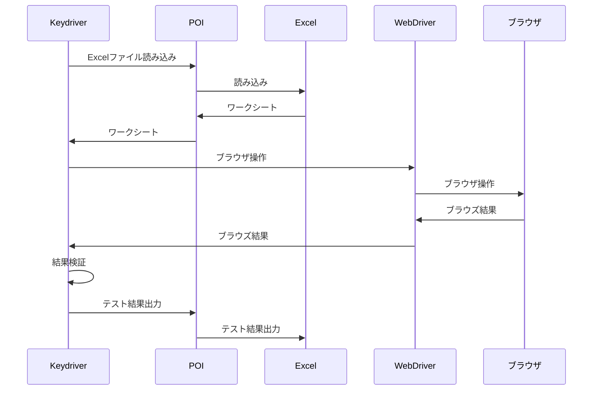

# marp-cliで作ったプレゼンテーション資料にUMLを埋め込みたい

Markdownでプレゼンテーション資料を書いてmarp-cliでHTMLに変換しています。シーケンス図などのUMLをmarp-cliのスライドに埋め込む方法としてはJavaScriptでMermaid.jsを埋め込む方法もありますが、Mermaid.jsはユースケース図に対応していないなど、PlantUMLを埋め込みたい場合があります。

marp-cliはプラグインで拡張できます。```marp.config.js```に設定を書くことでMarkdown中にPlantUMLの図を埋め込むことができます。

# ```marp-cli```のインストール

まず```marp-cli```をインストールします。

```
npm install --save-dev @marp-team/marp-cli
```

# ```markdown-it-plantuml```のインストール

つぎに```markdown-it-plantuml```をインストールします。

```
npm install markdown-it-plantuml
```

# ```marp.config.js```ファイルを書く

これが肝心の作業です。以下のコードを```marp.config.js```ファイルとして保存してください。

```JavaScript
const { Marp } = require('@marp-team/marp-core')

module.exports = {
    engine: opts => new Marp(opts).use(require('markdown-it-plantuml'))
}
```

# Markdownでスライドを書く

あとはMarkdownでスライドを書いていきます。

```
幻のテスト技法「キーワード駆動テスト」を追い求めて
====

2022-12-03 [@eyasuyuki](https://twitter.com/eyasuyuki)

<!-- paginate: true -->

---
(以下略)
```

-(ハイフン)が3つ続いた行がスライドの改ページです。

# MarkdownにPlantUMLを埋め込む

PlantUMLの埋め込みはこんな感じで書けます。

```
---

# 動作概念図

@startuml
    Keydriver ->> POI: Excelファイル読み込み
    POI ->> Excel: 読み込み
    Excel ->> POI: ワークシート
    POI ->> Keydriver: ワークシート
    Keydriver ->> WebDriver: ブラウザ操作
    WebDriver ->> ブラウザ: ブラウザ操作
    ブラウザ ->> WebDriver: ブラウズ結果
    WebDriver ->> Keydriver: ブラウズ結果
    Keydriver ->> Keydriver: 結果検証
    Keydriver ->> POI: テスト結果出力
    POI ->> Excel: テスト結果出力
@enduml

---
```

Markdown中にそのままPlantUMLのコードが書けます。



 # HTMLに変換する
 
 ```
 npx @marp-team/marp-cli --theme <CSSファイル> <Markdownファイル> --html
 ```
 
 PlantUMLの部分は下記のように変換されています。
 
 ```
 
```

今回のソースコード一式は以下で公開しています。

[https://github.com/eyasuyuki/keydriver-lightning-talk](https://github.com/eyasuyuki/keydriver-lightning-talk)

Mermaid.jsよりも多くの形式の図が描けるので使ってみてはいかがでしょうか。

