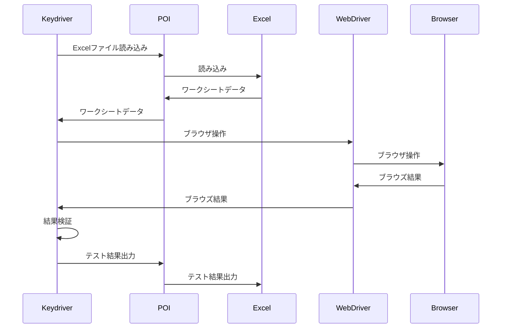

# キーワード駆動テストの簡単な説明

キーワード駆動テストとは、**アクションキーワード**と**テストデータ**から構成される表形式で記述するテストのことです。

| No | キーワード | 対象 | 引数 | 備考 |
-----|----------|------|-----|------
| 1 | open | URL | https://www.google.com/ | URLを開く |
| 2 | input | テキストボックス | サルゲッチュ | テキスト入力 |
| 3 | click | 検索ボタン | | ボタンをクリックする |

open, input, clickなどがアクションキーワード、URLや要素名、入力テキストなどがテストデータです。

キーワード表を読み込み、実際のWebページに対してアクセスを行うドライバーを開発すればテストを自動化できます。Keydriverはキーワード駆動テストのドライバー実装です。

# ユーザー定義キーワード

キーワード駆動テストではキーワードどうしを組み合わせて新たなキーワードを作ることも可能です。Keydriverでは他のワークシートを呼び出すことでこれを実現しています。

